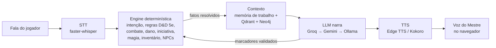

# VoxDM

> **EN, short version:** VoxDM is a voice-controlled tabletop RPG game master, entirely
> in Brazilian Portuguese, for people who have no GM and no group. A deterministic engine
> owns the rules (combat, damage, initiative, spell slots, NPC trust); the LLM only
> narrates. Work in progress, single player, runs locally on a consumer GPU.
> 2,813 automated tests. Designed and playtested by me, implemented with Claude Code as
> a coding agent.

Mestre de RPG de mesa por voz, com IA, todo em português. Pra quem quer jogar D&D e não
tem mestre nem grupo: você fala no microfone, o Mestre responde falando.

[Arquitetura](./ARCHITECTURE.md) · [Quickstart](./QUICKSTART.md) · [Contribuir](./CONTRIBUTING.md) · [Changelog](./CHANGELOG.md) · [Segurança](./SECURITY.md) · Licença [AGPL-3.0](./LICENSE)

---

## Status

**Em desenvolvimento. Não está pronto, e não finjo que está.**

O foco agora é um só: a experiência de **um jogador** ficar boa de verdade antes de
pensar em multiplayer ou app. Medido em 07/10/2026:

| | |
|---|---|
| Testes automatizados | **2.813 passando**, 2 `xfail` intencionais, 0 falhando (`pytest`, ~2,5 min) |
| Lint | `ruff` limpo |
| Código | ~40 mil linhas de Python (engine + API + ingestão), ~30 mil de teste, ~16 mil de TypeScript no frontend |
| Histórico | 884 commits na `main` desde 24/03/2026, 239 merges de branch |
| Conteúdo | 1 campanha original ("Os Filhos de Valdrek": 17 NPCs, 7 locais, 8 quests, 4 finais) + 319 magias do SRD 5.1 numa tabela local |

**O que já funciona ponta a ponta** (jogado em seis playtests de 30 a 60 turnos):

- O loop de voz inteiro: microfone → transcrição → engine → LLM → voz sintetizada no navegador.
- Criação de personagem, ficha persistente, continuar a campanha em outra sessão.
- Combate resolvido pela engine: iniciativa, ataque contra CA, dano, turno do inimigo, morte.
- Magia por declaração ("eu lanço Bola de Fogo"): a engine gasta o espaço, rola e aplica.
- Teste de perícia com CD (classe de dificuldade) decidida pela engine, não pelo modelo.
- NPCs com memória de confiança entre sessões, campanha que caminha até um final.

**O que ainda não funciona ou não foi provado:**

- **A sensação de risco.** A pergunta que guia o projeto agora é *"você parou de arriscar
  porque calculou que ia doer?"*. Dois playtests disseram que não. As correções já
  entraram (consequência de falha decidida pela engine, fichas de inimigo reais), mas
  **ainda não foram jogadas** — e esse tipo de coisa teste verde não prova.
- Latência: a última medição jogada deu ~4,6 s (mediana) entre a fala e a primeira voz
  do Mestre, acima da meta de 4 s. Foi medida antes da troca do modelo principal em
  agosto e precisa ser medida de novo.
- Sem multiplayer e sem app. Roda local, numa máquina com GPU NVIDIA.
- Uma campanha só. O formato de módulo está especificado, mas a importação de outras
  aventuras ainda não está pronta pra uso.

---

## A ideia central: a engine manda, o LLM narra

O jeito fácil de fazer um "mestre de IA" é mandar tudo pro LLM e torcer. Funciona por
dez minutos. Depois o modelo esquece quanto de vida você tem, inventa que o ataque
acertou, dá um item que não existe ou encerra a campanha sozinho (aconteceu, no turno
31 de um playtest).

O VoxDM inverte isso (**engine-first authority**): tudo que é número ou regra é
decidido por código determinístico e testável. O LLM recebe os fatos prontos e decide só
*como contar*. Ele nunca decide **se** você acertou, **quanto** doeu, nem **se** o item
saiu do inventário.



Siglas: **STT** = speech-to-text (fala vira texto); **TTS** = text-to-speech (texto
vira fala); **LLM** = large language model; **SRD** = a parte aberta das regras de D&D
5e; **RAG** = buscar contexto relevante antes de chamar o modelo.

Quando o LLM quer mudar o mundo (apresentar um NPC, abrir uma quest), ele emite um
marcador no fim da resposta. A engine valida antes de aplicar e o marcador é removido
antes de virar áudio. O desenho completo está em [ARCHITECTURE.md](./ARCHITECTURE.md).

### Stack

| Peça | O que usa | Por quê |
|---|---|---|
| Backend | FastAPI + WebSocket | Streaming do texto e do áudio turno a turno |
| STT | faster-whisper `large-v3-turbo` na GPU, com hotwords dos nomes da campanha | Medido: 3,67% de erro de palavra e ~0,6 s por fala |
| LLM | Cascata Groq (`gpt-oss-120b` → `gpt-oss-20b`) → Gemini → Ollama local | Tudo em free tier; se um provedor cai ou estoura cota, o turno não morre |
| TTS | Edge TTS, com Kokoro-82M local como reserva | Voz natural em pt-BR sem custo; voz e ritmo diferentes por NPC |
| Memória | De trabalho (estado da sessão), episódica (Qdrant) e semântica (Qdrant + grafo Neo4j) | O Mestre lembra do que aconteceu e de quem conhece quem |
| Persistência | SQLite (aiosqlite) | Ficha, inventário e progresso entre sessões |
| Frontend | Next.js 14 + Tailwind | Ficha, combate, dados e a fala do Mestre |
| Acesso remoto | Cloudflare Tunnel + Access (JWT) | Pensado pra abrir pra amigos sem expor porta |

Custo de operação hoje: zero. Tudo roda em free tier ou na máquina local.

---

## Como foi construído

Eu desenho a arquitetura, decido o que o jogo deve ser e jogo pra ver se presta. O código
é implementado pelo [Claude Code](https://claude.com/claude-code) trabalhando como agente
no repositório.

Não é "pedi pro chat e colei". O processo tem regras, e elas estão versionadas:

- **Cada mudança numa branch própria**, com teste e `ruff` antes do merge. A suíte cresceu
  junto com o código; hoje são 2.813 testes.
- **Um documento de convenções pro agente** ([CLAUDE.md](./CLAUDE.md)) com as decisões
  travadas e, principalmente, as armadilhas que já custaram caro — cada uma com o
  sintoma e o porquê.
- **Teste verde não fecha tudo.** Mudança que afeta a sensação do jogo só entra
  validada depois de eu jogar uma sessão real. Esses "gates de sessão jogada" estão
  marcados na fila de trabalho.
- **Decisões grandes viram ADR** (registro de decisão de arquitetura), com o problema, a
  alternativa descartada e o motivo.
- **Medir antes de afirmar.** Qualidade de narração tem detector próprio
  (`engine/quality/tells.py`) e benchmark com várias rodadas, porque uma rodada só de LLM
  mente nas duas direções.

O meu papel é o de tech lead e de playtester: especificar, priorizar, cobrar critério e
dizer quando o resultado não está bom, mesmo com os testes verdes.

---

## Como rodar

Pré-requisitos: Windows ou Linux, **Python 3.12** (não 3.14), Node.js 20+,
[uv](https://docs.astral.sh/uv/) e, de preferência, GPU NVIDIA com CUDA. Sem GPU funciona,
mas a transcrição fica bem mais lenta.

```bash
git clone https://github.com/JoaoBeltrami/VoxDM.git
cd VoxDM
uv venv --python 3.12 .venv
uv pip install -r requirements.txt
cd frontend && npm install && cd ..
cp .env.example .env   # preencha as chaves (abaixo)
make ingest            # carrega a campanha no Qdrant + Neo4j
make ingest-rules      # carrega as regras do SRD
make run-api           # API em :8000
cd frontend && npm run dev   # interface em http://localhost:3000
```

Chaves obrigatórias no `.env`, todas com plano gratuito: `GROQ_API_KEY`
([console.groq.com](https://console.groq.com/keys)), `QDRANT_URL` + `QDRANT_API_KEY`
([cloud.qdrant.io](https://cloud.qdrant.io)), `NEO4J_URI` + `NEO4J_USER` +
`NEO4J_PASSWORD` ([AuraDB Free](https://console.neo4j.io)). Gemini e Ollama são opcionais.
Pra rodar local sem Cloudflare, defina também `DEBUG=true` e `DEV_USER_EMAIL`.

Passo a passo completo, com verificação de GPU e problemas comuns: [QUICKSTART.md](./QUICKSTART.md).

```bash
uv run pytest tests/ -q     # suíte inteira
uvx ruff@0.15.16 check .    # lint (mesma versão do CI)
cd frontend && npx tsc --noEmit
```

---

## Próximos passos

1. **Jogar o que já foi construído.** Quatro mudanças grandes (consequência de falha,
   combate em dois tempos, magia pela engine, fichas reais de inimigo) estão com teste
   verde e sem sessão jogada. Antes de empilhar coisa nova, elas precisam ser jogadas.
2. **Inventário cobrado de verdade:** usar só o que está na mochila, menos no perfil de
   mestre "rule of cool".
3. **Estado legível no momento certo:** o jogador entender a ficha, o item e o teste sem
   sair da cena.
4. **Abrir pra amigos** pelo Cloudflare Tunnel, depois de fechar as pendências de
   segurança da lista.

Multiplayer e app mobile só depois disso tudo segurar.

---

## Licença

[AGPL-3.0](./LICENSE). Pode usar, estudar, modificar e redistribuir; quem hospedar uma
versão modificada precisa abrir o código.

As regras de D&D usadas são do SRD 5.1, da Wizards of the Coast, sob CC-BY — veja
[NOTICE](./NOTICE). Nenhum material licenciado ou fechado entra no repositório; por isso
a única campanha é original.

Vulnerabilidade? Use o reporte privado descrito em [SECURITY.md](./SECURITY.md), não issue
pública.
